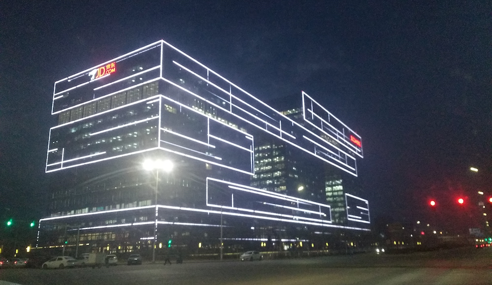
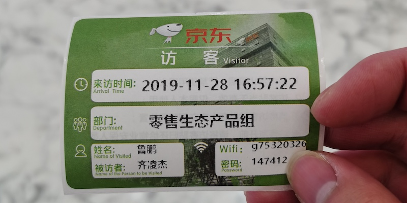

这是「产品经理面试经历」的最后一篇文章了，上个月（11 月份）面试了整整一个月的时间，共面了十来家公司。

在 11 月底的时候，我已经决定要去上班了，实在不想再等了。

由于快到年底了，机会更加的渺茫了，再去参加面试也是耽误时间，另外，想着在年前，挣点买年货。

将要去新公司报道的前一天，我收到了京东的面试邀请，去之前我就已经想清楚了，这次面试的目的，只是为了进去体验一番，天天用京东，还没去过京东呢。

面试是否能够通过，倒没有那么重要了，因为即便我侥幸通过了一面，接下来的二面，三面，我也没有时间去参加了，大公司的面试流程，我还是有一些了解的。

曾经有大概一年的时间，我每天下班回家都路过京东总部大楼，不得不说，京东总部大楼在那一片区域，辨识度以及回头率还是相当高的。

那天约的是下午五点，到的时候，天都快黑了，我把车往路边一停，就进去了，结果违停，被罚了 200 元，真是郁闷。

以前远远望去的时候，觉得很是气派，今天近距离观看，感觉很高大上。

进去之后，在大厅的机器上，办理了访客通行证，里面员工给你申请，你自助刷身份证就可以了，这个还是很方便的。

通行证是为了可以进入电梯间，去办公楼层，如果不办理通行证，1 楼的大厅，也是可以逛一逛的，里面有小超市，咖啡厅，甚至还有物流站，就像一个小型商场了。

想像如果能在这里上班，应该还是挺爽的，特别针对我这个曾经在工厂里工作过 4 年的人来说，原谅我没见过什么世面。

面试约在了顶层一个露天吧台（说是专门用来面试用的），面试官是一个年级相仿的产品经理，至于他的职位，我倒不是很清楚。

面试的问题，也比较常规，聊得比较随意，对方大体上，还是在考察我的过往工作经历，与当前岗位的匹配度。

从他的表述来说，他们这个岗位在找**规划型产品经理**，据我的理解，就是偏业务方向的产品经理。

更多的职责是从商业的角度出发，实现产品价值，最大限度的为公司带来利益。

对照之前的一篇文章：[如何从 0 到 1 做一款产品](/posts/2019-11-24-product-0-1)，这个岗位要做的事情，其实就是前面 4 步，后面的工作，有另外的产品经理来对接。

工作的具体表现，就是写文档，产出 BRD（商业需求文档）或是规划方向的 PRD（产品需求文档），而不是与开发设计打交道的那种。

