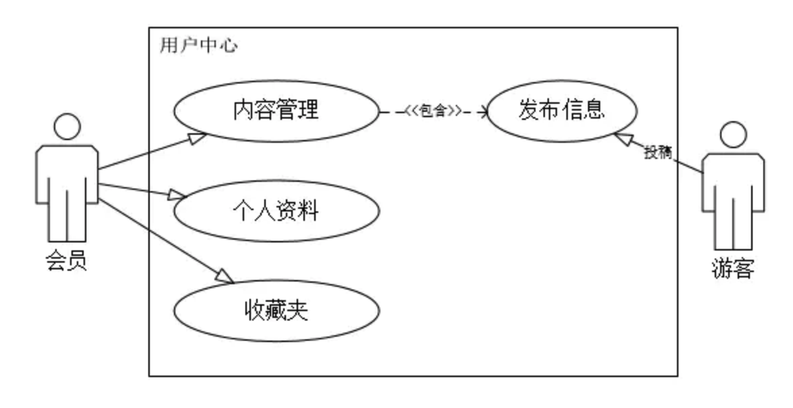

参考：https://www.jianshu.com/p/844f23a50d44

产品用例是一种通过用户的使用场景来获取需求的方式，每个用例提供了一个或多个场景，该场景说明了产品是如何和最终用户或其它产品互动，也就是谁可以用产品做什么，从而获得一个明确的业务目标。

用例(Use Case)是一种描述产品需求的方法，使用用例的方法来描述产品需求的过程就是用例模型，用例模型是由用例图和每一个用例的详细描述文档所组成的。

用例起源和发展于软件时代的产品研发，后来被综合到UML规范之中，成为一种标准化的需求表述体系。虽然用例在软件研发和技术工作中应用的非常广泛，但是在互联网产品规划和设计中，并不经常使用，互联网产品的需求表达为了敏捷效率，通常采用原型加产品需求文档。

用例描述文档基本上是用文本方式来表述的，为了更加清晰地描述用例，也可以选择使用状态图、流程图或序列图来辅助说明。

- 流程图有助于描述复杂的决策流程
- 状态转移图有助于描述与状态相关的系统行为
- 序列图适合于描述基于时间顺序的消息传递

参考： https://juejin.im/post/5b3a20d5f265da62ca37a65f

用例图强调了从用户自身角度解决其需求的产品/系统是什么以及如何使用，不关心它的具体实现。
