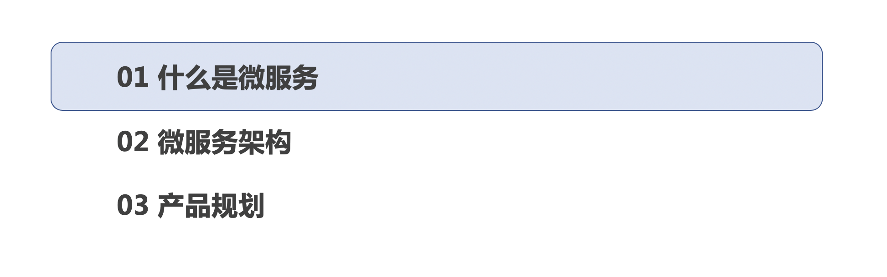
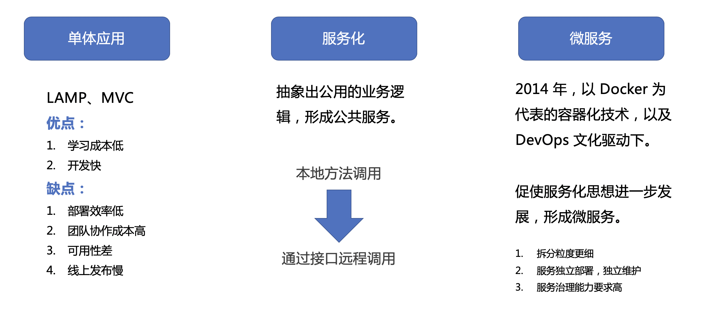
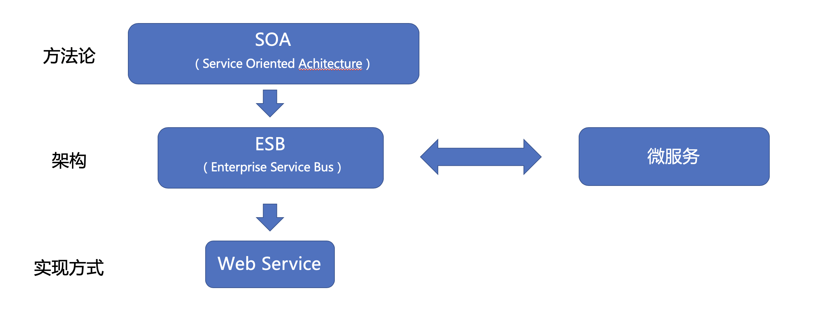
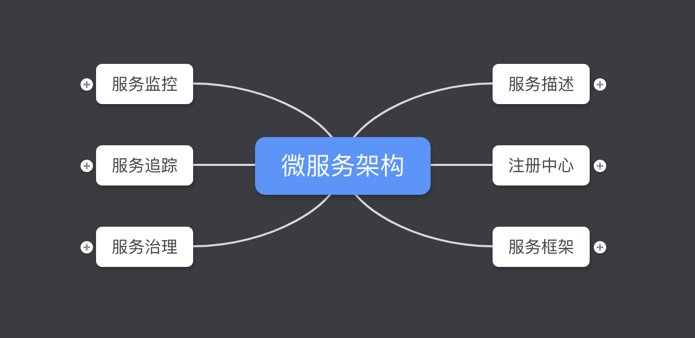

微服务，这其实是一个比较大的概念，就像问什么是「人工智能」，什么是「大数据」，什么是「区块链」一样，似乎很熟悉，但是，好像又说不出什么来。

上次在讨论产品架构的时候，我们谈到了微服务的这个方向，而我在之前公司也接触过一些这方面的工作，一直想要整理一下，所以，借着这个机会，整理出来，分享给大家，耽误大家大概半个多小时时间，相信一定能有一些收获。

我在整理的过程中，就发现，原来之前我接触的那些工作，实在是冰山一角，微服务涉及到的内容，实在太多了，就像之前金硕分享过的「数据挖掘和人工智能」课题一样，听上去很简单的一个词，其实里面的内容很深。

### 目录

下面我就从这三个方面来讲一下：

- 第一个就是「什么是微服务」，尽量把一些定义和概念性的词汇给捋一下；
- 第二点讲一下微服务架构到底包含哪些内容，或者说包含哪些技术；
- 第三点，接着上周分享的产品架构，简单谈一下接下来 SealLab 产品可以尝试从哪个方向去做，当然这里只是给个建议，具体技术实现，可能还需要龙哥他们团队去研究。

### 什么是微服务
首先来看下，什么是微服务。**每一个技术的发展都是由业务驱动的**，这个大家没有什么异议吧。

正是由于当前技术方案已经不能满足业务需求，我们才会去研究新的技术方案，于是，就会出现一堆新的技术名词。什么负载均衡，什么 Redis，什么 MemCache 等等。

所以，我觉得还是花几分钟的时间，讲一个故事，

- - - - - 

SOA：是面向服务体系架构。

ESB：企业服务总线是一种模式，通过该模式，集中式软件组件可以执行与后端系统的集成（以及数据模型的转换，深度连接，路由和请求），并将这些集成和转换用作服务接口，以供新的人员重用。

Web Service：SOA 的一种实现技术。Web Service 基于两种协议：soap 和 rest 协议。现在常用的是rest 协议。

> SOA 是方法论，就像建筑学一样，指导性质的；
> ESB 是建筑图纸，理顺整个建筑的架构；
> Web Service 是具体的建筑材料，就好像预制板；

web service （web 服务）是一种分布式部署系统的一种模式，意思就是说分布式的部署系统可以采用webservice技术来写相关的接口。

微服务是web service的细化，是它的升级版，比webservice更加的灵活。

微服务架构可将单个应用程序的内部分解为小块，这些小块可独立更改，扩展和管理。随着虚拟化，云计算，敏捷开发实践和DevOps的兴起，微服务应运而生。

### 微服务架构

### 产品规划
说完了微服务架构，好像这个方案挺高级的，组件也很完备，但是，我们一定要认识到一点，那就是：技术是中立的，适合自己业务的才是最佳的。

这中间有一个演变的过程，不同的业务阶段，需要采取不同的技术方案。

例如在产品验证阶段，我们一个单体应用就能解决用户痛点，满足用户需求，那么单体应用就是最佳的技术方案，随着业务的发展，单体应用带来的弊渐渐大于利，我们就需要考虑其他的技术方案，就像开头故事里讲的那样。

接下来，我们就要去想，我们的业务处在什么阶段，要采用什么样的技术方案？