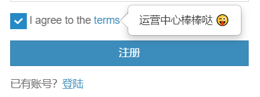

> 这是《我的产品技术之旅》的系列文章，每篇文章，我都尽量保证是一个完整的故事，但不可避免会有些前后关联，毕竟这是一个成长的过程。

接上一篇，这篇文章介绍，我一个人历时半年多时间，开发的那个运营数据平台。

先回答一下，前面提到的几个顾虑点：

Q：你的本职岗位工作怎么办?占用自己的时间？

> 这个问题不大，直属领导对我的工作还是默许的，原本也只要求我用一半的精力来做运营的工作，所以，这个项目的开发还是有时间保障的。
>
> 况且，自己想干的事情，也就无所谓工作时间还是业余时间了。中间有段时间，为了提高开发效率，我甚至把家里的 Mac mini 搬到公司去了。

Q：万一你做不出来，怎么办？这不是闹笑话吗；

> 最开始，我是基于财务经理的痛点需求着手的，起初只是实现财务数据信息化的功能，并没有一开始就规划得很大很全，所以，整个项目的开发，都在能力范围之内。
>
> 对于不熟悉的技术点，都是现学现卖，这种状态下，效率出奇的高。

Q：万一你做出来了，领导不认可怎么办，觉得你浪费了人工；

> 这确实是个问题，也的确发生了，不同的是，领导认可我的人，但不认可我做的事，这件事，也让我有了一些思考，后面会专门再谈到。

Q：这不是你的本质工作，你做了这部分工作，产品部门的人怎么想?开发部门的人怎么想？

> 这个就有意思了，我做一半的时候，「正规军」终于开始启动了，然而，最后的结果是，他们的项目还没上线，就被砍掉了，我写的现在还在服务器上跑着呢（写这篇文章的时候，我还专门去看了一眼，一切照旧）。

> 至于别人怎么想的问题，是我想多了，大家其乐融融，开发过程中，还互相交流借鉴了下。
>
> 也许在别人眼里，工作仅仅是工作而已，你愿意干，你干呗，你干了，省我心了，何乐而不为。

### 开始做了

入手去做这个事情，其实非常简单而自然，没有太多的曲折。

就像之前做的几个信息系统一样，了解用户痛点，挖掘需求，产品设计，开发，测试，上线部署。

而这一次工作的开展，似乎更加的顺畅，原因有二：

一，直属领导是默许的，希望我去做一些改善工作，况且她给了我一半的自由时间，我不必陷入琐碎的运营工作，而无法自拔；

二，财务经理在跟我抱怨的期间，也渐渐跟我熟悉了起来，对于用户需求，我可能是最熟悉的了，比之前的产品经理，要了解得更多，更深入，况且，我自己本身也是半个用户，因为我有一半的时间，也在做项目运营的工作；

在那段时间里，我非常强烈的感受到自己工作的价值，我甚至妄想过，我一个人，正在做着价值上百万的项目，最后这个软件可以成为公司不可或缺的一部分。

### 产品规划

对了，这根本不是公司正规流程下的项目，正规流程的那个项目，还停留在审批里呢。

这里所说的产品规划，仅仅是我个人对这个项目的规划，就像上面所说，我希望它能够成为公司信息化系统的一部分。

既然是信息系统的一部分，必然要考虑与其他系统的对接，这是

### 全流程开发

从 0 到 1，一个人完成了产品的全流程，当然，中间省去了很多的环节，例如：设计，测试以及项目管理。

设计直接就找了个开源库，套用了上去，甚至原型都没有画；测试仅仅是自己点了点，然后是用户直接反馈，我修改 Bug；项目管理更是不需要了，一个人的开发，做好个人管理就可以了。

这个状态大概持续了将近半年的时间，从业务，到需求，到产品，到开发，到上线，一个人把控的感觉真的很好。

即便每天忙个不停，也觉得很有意义。但是，这种意义时候真的有意义，还值得进一步的思考。

开发的这套平台，财务专员满意，系统最初实现的功能，就是为了解决财务统计数据的痛点。有了系统之后，很多数据的问题就前置了，避免堆积到月底财务汇总的时候才发现。