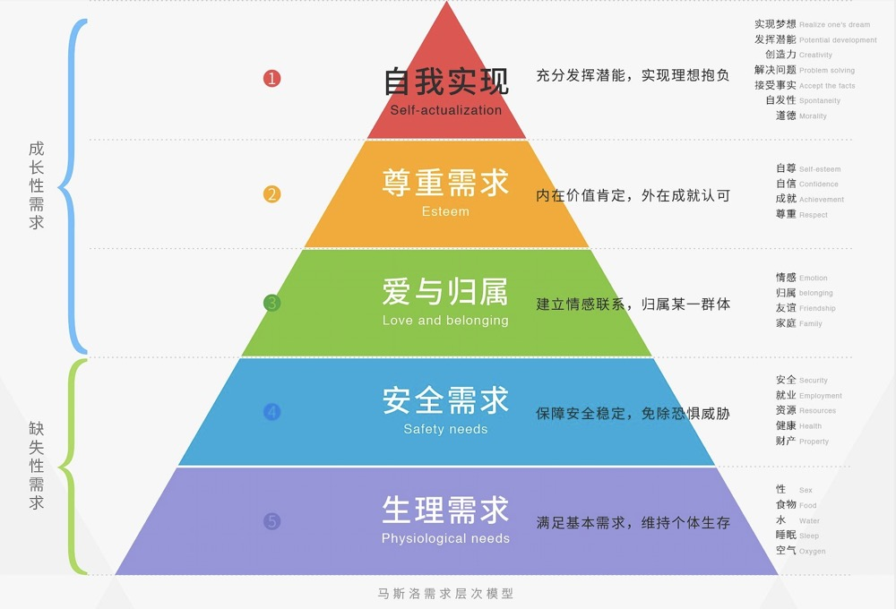

> 这是《我的产品技术之旅》的系列文章，每篇文章，我都尽量保证是一个完整的故事，但不可避免会有些前后关联，毕竟这是一个成长的过程。

我的岗位是产品经理，准确的讲，是企业内部产品经理，职责就是在业务部门（用户）和开发部门（技术）之间建立起必要的连接。

业务部门的同事会针对自己的实际业务，对企业内部系统提出需求，我们要做的就是了解实际业务（需求分析），产出系统功能需求（需求文档），然后在业务部门与技术部门之间协调（项目管理），完成产品功能，满足业务需求（交付）。

这整个工作流程其实是比较单一的，尤其是在你熟悉了对应的业务之后，就更加的枯燥了。对于大公司来说，他可能并不需要一个技能很全面的产品经理，而是需要一个螺丝钉型的产品经理，深耕在某一个具体的领域，这个话题后续再聊。

在这个岗位上，工作了一段时间之后，渐渐感觉自己对这个领域，其实并不太感兴趣，很多项目的开展显得力不从心，并不是我不想做好，而是很多事情，并不是你努力了，对产品需求的把握更专业了，技能更加娴熟了，就代表能够做好了。

并不是这样，中间会有很多外在的，超出能力范围之外的力量，在牵引着整个事情的进展。单纯靠自己的能力，似乎发挥不了太大的作用，有种无法掌控的感觉，于是，也渐感麻木。

工作中，找不到成就感，其实是很危险的。根据马斯洛的需求层次模型，现代社会的我们，更需要的是「成长性需求」。

对比层次模型，那时的自己应该处在「尊重需求」这一层，也就是「内在价值肯定，外在成就认可」。

而岗位的本职工作，几乎没有外在成就，而自己对它的内在价值也保持迟疑的态度。所以，那时的自己，想要去做不一样的尝试，也就能够理解了。

最开始提到的，利用静态博客站点的技术，搭建内部知识库的站点，就是自己对「尊重需求」的探索。

这个尝试产生了一些正面的反馈，直属领导的肯定，也可以算是在这个岗位上的成就吧，即便它并非是主要职责工作。

如果直属领导的肯定，只能勉强算作是岗位工作的成就，那么下面这个事情，肯定算是岗位的成就了。

当时，我们的主营业务是显示领域的生产制造，所以，我们的研发岗位都是聚焦在显示领域，研发岗位的工作有一项重要的 KPI，那就是专利。

我们并不是属于研发序列，我们组织的工作，最初的定位，更多充当的是辅助的角色，辅助主营业务做信息化的转型，提升业务效率。

后来集团对信息化的要求越来越高，信息化组织从辅助的角色，慢慢变成领跑的角色，不再是满足业务需求，而是要带领业务，走信息化的道路。其实，这个观念的转变，已经算是很迟的了。

对于一线的员工，其实看不出有什么明显的变化，唯一能感受到的是 KPI 添加了一项，那就是要写专利了。

在学校都没有写过专利，上班了竟然要开始写专利了，然而，在公司里写专利，实则比在学校里方便太多了。

公司有专门的专利部门，甚至有专业的第三方专利机构代为申请。我们要做的，仅仅是提交一个创新的想法而已。而且，这个创新还是相对的，并非从未有过，才算创新，而是别人没写过的就可以。

那个时间点，我正在鼓捣静态站点的事情，静态站点的优点就是无需开发，快速部署，非常适合单方面的展现类网站。但是，缺点也很明显，页面需要更新的话，就要重新部署，例如博客中，文章评论等动态功能就需要借助第三方。

基于对这个事情的琢磨，顺便就写了一篇专利，后来居然获得了国家授权，在我离职后，公司的专利专员还在联系我，说正在申请美国的专利，这个倒是我没想过的意外收获，写这个专利，当时也是为了完成部门的 KPI，而这个过程我所做的工作，只是把想法写了下来，后面的所有的工作，包括申请费用啥的，公司都帮你做了，而且你还能获得一笔专利奖，感觉没有比这更划算的事情了。

你可能会说专利所属权就变成公司的了呀，没错，利用工作时间产出的专利成果，都归属于公司所有。不过，说实在话，公司每年产出几万份专利，真正有用的，能占到两成就不错了。大多数的专利都只是一个充数作用，对于上市公司而言，更是如此，可以对外宣称公司对研发的投入重视程度。

我写的那份专利，应该是我们组织有史以来第一份通过国家授权的专利，后来，基于这个思路，我又写了第二篇专利，依然是围绕静态站点的那些问题，提出的一种一体化解决方案，当然前提肯定是在专利网站上查重排除过的。

这篇专利花了我更多的时间和精力，自认为提出的创新点也比第一篇要好，可是，被自己组织内的「专家组」给拒了，被拒的原因不知道。

随着我们组织专利的提交，集团的专利部门可能应对不过来了，于是，我们组织内部成立了「专家组」来做第一层的筛选工作。

所谓的「专家组」并不是专利领域的「专家」，也许他们自己一篇专利也没有写过，但是，却有权利去评价别人的专利是否符合专利要求，感觉这个就有点社会了。

被拒之后，我也没有去申诉，因为我也不知道是什么理由被拒，再后来调岗了，也就把这个事情淡忘了。

只是最后没有想到，我随意写的那篇专利，居然整到美国去了，也是意外的惊喜吧。