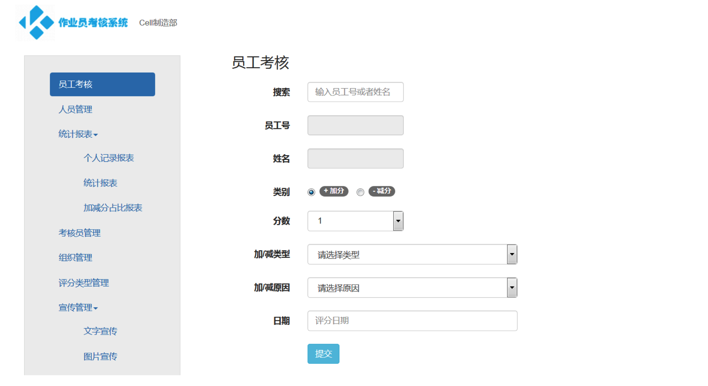

> 这是《我的产品技术之旅》的系列文章，每篇文章，我都尽量保证是一个完整的故事，但不可避免会有些前后关联，毕竟这是一个成长的过程。

这篇文章介绍学习 Node Web 的过程，在。

---

岗位职责之外，给公司做的第一个开发相关的项目，就是前面提到的知识库站点。严格意义上，它并不需要开发技术，但涉及到的知识点还是比较全的，从前台最基础的网页，到后台服务器的部署，都有涉及。例如：Markdown、Hexo、HTML/CSS/JavaScript、Nginx 以及 Linux 等。

如果完全没接触过这些零散的知识点，还是需要一些时间去了解的。而对于我来说，却比较容易了，因为我一直在尝试拓宽知识面，却很难深入到某个点（苦笑）。

做这个事情，让我尝到了一丝的甜头，在部门内，也渐渐有了「技术男」的标签，毕竟我那个岗位是几乎不需要 IT 技术的，我在其中找到了一些「内在价值肯定，外在成就认可」的感觉，满足了我的「尊重需求」。

于是，我开始寻求「自我实现」。

### 重新捡起开发

那段时间，我接触了一个新的开发技术 Node，它是 JavaScript 语言的后台运行环境。它诞生于 2009 年，创立之初，是为了获得一个高性能的 Web 服务器并提供一套库。

前端由于它的诞生，大放异彩，逐渐发展出了大前端的概念。在我接触 Node 的时候，它就已经很火了。像前面提到的 Hexo（静态博客框架），就是基于 Node 开发的，虽然 Node 很火，但是与 Java, PHP 等相比，就显得小众了些。

像之前提到的 Hexo（静态博客框架），就是基于 Node 开发的，虽然 Node 很火，但是与 Java, PHP 等相比，就显得小众了些。但是，我觉得很酷。

除了酷，它还有很多优点，例如简洁、开发效率高，使用 Node 开发一个 Web 站点，非常快，写一个 HTTP 服务，只需要短短几行代码就搞定了，简直是全栈开发必学的技能之一。

貌似，全栈开发这个词，就是在 Node 诞生之后，才慢慢火起来的，因为前端开发者常用的 JavaScript 语言，借助 Node 的环境，也可以做后台开发了。

前端工程师可以一个人解决前后端的开发，后来又渐渐出现「大前端」的概念，那个时候，前端真的是火得不行，现在依然很火。

在选定 Node 之后，我开始做一些小的系统用来练手，什么需求都做，有时可能是一句话，也有可能是自己 YY 出来的需求，只要有机会，我都会做。当然，在一个传统的制造企业里，从来就不缺信息化的需求。

有那么一段时间，我只要看到某些效率低下的工作方式或流程，我就在想，能不能通过线上协同的方式去提高效率。

### 练手的那些系统
需求真的是应接不暇，只是个人精力有限，毕竟还有一堆岗位职责的事情需要处理。

下面就简单列举一下，我用来练手的那些系统，姑且就叫「系统」吧，虽然大多都只是简单的「增删改查」，根本就称不上所谓的系统，但从这些项目的开发中，我成长得很快。

具体的业务和需求就省略了，只是从产品技术的角度来叙述。

#### 1. 评分系统
这应该是我使用 Node 开发的第一个 Web 站点，它甚至连最基本的用户管理都没有，但它让我学会了很多基础的概念。例如：

- 了解了页面模版的概念
- 学会使用 bootstrap 样式库去搭建页面
- 学会使用 express 框架作为后台服务
- 学会使用 Node 访问 MySQL 数据库

这个在部门内用了几周，就没再用了，非常简陋的一个站点，仅仅满足了投票打分的核心需求。

专门找到了当时写的几篇介绍文章：[标签: 评分系统 | 个人学习](https://iamlupeng.com/tag/%E8%AF%84%E5%88%86%E7%B3%BB%E7%BB%9F)，读完后，当时的心境和状态，油然而生，挺有意思。

#### 2. 需求收集系统
这是个半成品，甚至都没有部署到线上，只是存在于我的电脑里，在这个项目里，我开始学会使用一些开源的前端组件，例如常用的有：

- bootstrap-fileupload 上传插件
- bootstrap-table 表格插件
- jquery-cookie 

随着后面系统的开发，使用的第三方库也越来越多，后来，我还专门创建了一个开源项目，用来收集以及总结这些开源组件的使用方法。

GitHub 地址：https://github.com/pengloo53/js-plugin-example

在这个项目的练习上，除了学习组件的使用之外，开始逐渐学习模块化的开发，例如将数据库相关配置独立，再抽象出业务调用数据的模块。

当时也写了几篇介绍文章，只是不完整，就写了 3 篇，[标签: 需求收集系统 | 个人学习](https://iamlupeng.com/tag/%E9%9C%80%E6%B1%82%E6%94%B6%E9%9B%86%E7%B3%BB%E7%BB%9F)，这里，大多数精力都花在了前端组件的使用上了。

#### 3. 考核系统

这是我第一个完成程度较高的系统，这个系统的需求不是我自己 YY 的，是我们做客户拜访的时候，领导接回来的。

这原本也不是我们的岗位职责，接这个任务，是因为客户有非常明确的需求，而我们恰好又有能力去做这个事情，另一方面，部门领导也想给部门的工作找些亮点。

和前面不一样，这个项目，我只是负责开发，前期的需求沟通是部门另外一个同事做的，还有一个同事帮忙写 SQL，所以，这个项目中，我的角色只是程序员。

经过前面几个系统的练手，做这个项目的时候，还算得心应手，况且我只负责开发，所以，我记得差不多两周的时间，我就完成了所有的开发工作，功能并不复杂，花时间最多的是前端页面布局和样式。

做完这个项目，发现了两个问题，也就是改善点吧。

- 一个是前端页面太费时间了，如果有现成的页面模板的话，就省事多了
- 数据库的调用太 Low 了，这个项目的数据库调用都是采用字符串拼接 SQL 的方式

当然收获就是：

- 了解了完整的项目结构搭建
- 各种前端第三方组件的学习和使用（当时只是停留在 jQuery 和 Bootstrap 上）

不出意外，这个项目应该还跑在公司的内网服务器上，相关的业务参数是动态配置的，所以，如果没有大的业务调整，应该还能跑上一阵子。

