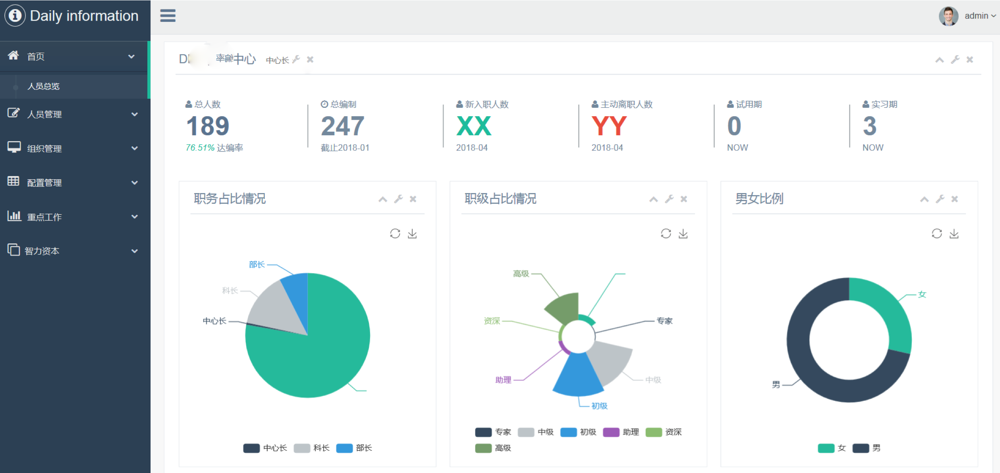

> 这是《我的产品技术之旅》的系列文章，每篇文章，我都尽量保证是一个完整的故事，但不可避免会有些前后关联，毕竟这是一个成长的过程。

这篇文章继续介绍学习 Node Web 的第二个阶段：解决问题，从单点实际问题出发，规划系统功能，提升效率。

第一阶段仅仅是对开发的练习，并没有去考虑做这个事情的价值，单纯是自己感兴趣，而去学习而已。

后来，接触了一些比较大的项目管理工作，我渐渐发现，

这是给自己做的一个效率工具，中间有一段时间，部门领导担任一个集团大项目的项目经理，而我为了协助部门领导，承担了一些项目资料收集整理，项目周报，项目文档的一些工作。

那是公司还没有项目管理系统，这些工作需要通过 Office 和 email 的形式来处理，由于项目范围比较大，分为了 5 个小组同时开展工作，每周我都要处理 5 个小组发过来的周报相关内容，然后汇总到一块，交给部门领导审核，最后邮件知会到项目成员。

如果只是这样的话，似乎没多大的工作量，关键是：

1. 每个小组并不能够一次性准确的把周报内容提供给你，通常情况下，你的邮件列表是这样的：
   - xxx 小组 —— 周报 v1
   - yyy 小组 —— 周报 v1
   - aaa 小组 —— 周报 v1
   - yyy 小组 —— 周报 v1.1
   - zzz 小组 —— 周报 v1
   - xxx 小组 —— 周报 v1.1
   - bbb 小组 —— 周报 v1
   - xxx 小组 —— 周报 v1.2
   - ccc 小组 —— 周报 v1
   - ......
2. 即便你提供了统一的周报模板，你收到的周报，里面的格式依然是五花八门。例如：
   - 对于列表，有的人是这样写的：`1、`，有的人是这样写的：`1.`，甚至有的人这样写：`1。`
   - 对于重点内容，有的人加粗，有的人加大字体，有的人换字体颜色，有的人换底色

这还仅仅只是针对周报（通常是 Word）的汇总工作，另外，还有 Excel 类，例如：开发清单。更新汇总的时候，更是头疼，可能开发团队那边，早就更新了列表，你这里却没有同步更新，你拿到了他那边最新的列表，却不知道到底哪行更新了什么，整个就是两个字：头疼。

知道了这些，你再来衡量一下工作量。

明明每天都忙哄哄的，却感觉似乎什么也没干，不禁感叹，时间都去哪了？

这就是办公效率低下，最典型的例子，重复的干着这样的工作，确实有点头疼，所以，我做了这个周报系统。

由于我当时技术或精力有限，它的页面很粗糙，功能也不完整，仅仅是满足了我上述工作中的部分痛点诉求。

基础功能完成并上线的时候，我发邮件给项目成员，让大家按照这个系统的方式，给我提交周报等内容。

起初，我以为大家会觉得麻烦，毕竟习惯这东西是很难改变的，但是，用了几周之后，反馈还不错，偶尔还给我提个 Bug 啥的。

这个项目完结之后，我也调离了这个部门，这个系统也就下线了。

再后来，项目组里的一个同事，看到集团在举行 TopCoder 大赛，想邀请我一块去参加这个活动，就拿这个周报系统去参赛，我受宠若惊。

但由于新部门的工作有点忙，也就放弃了，我把系统的源代码都给了她，她跟她们部门的同事去参加比赛了。

虽然她们没拿到啥奖，但是，我做的这个系统，真的有人觉得有用，我还是很开心的。

#### 2. 人员系统

来到新的部门，离产品技术更远了，新的岗位虽然职级晋升了，但却是我职业生涯的至暗时刻。也是在那个时候，让我产生了对未来职业的思考。

在原来的部门里，虽然「内部产品经理」这个岗位没多少成就感，但是，与部门领导以及同事之间的相处，还是非常愉快的。毕竟也是我的第一份岗位，在这个岗位上学到了很多产品经理的基本功。

一晃 3 年过去了，在传统的大企业里，管理岗是唯一的晋升途径。虽然明面上说是有多条晋升途径，然而，傻子都知道，在这种环境下，走向管理岗，才是最明智的选择。

我算是比较幸运的吧，管理职级晋升，谁又会不愿意呢，就算你对管理啥的提不起什么兴趣，但对薪资总在乎吧。

新的岗位不再直接处理一线的业务，更多的是收集信息，汇报以及管理。在这个层面上，很多工作就不再那么具体而单纯，对或错，全凭主观意识。新的岗位一下子让我接触了太多的「虚」，这个「虚」似乎与我格格不入，一度让我很难受。

与直属领导的冲突，点燃了这根导火索，即便被认为是不够成熟，我也要离开，下定决心的那种，最后，我选择了调岗，直接脱离了信息化组织。

有点偏题了，拉回来。这个岗位工作涉及的范围更广了，我需要面对的是不同公司的十几个部门，从他们那获取我想要的信息，然后汇总，向上汇报。

上面谈到的项目管理工作，所要面对的还只是 5 个小组的信息汇总，这个面对的是十几个，你可以想象一下这个工作的

#### 6. 运营数据系统

这种需求，大多是协同办公效率提升的方向，例如收集资料等。自己写的 demo 就不说了，拿出来给同事实际用过的系统（姑且都叫系统吧），就有：学习会评分系统、作业员考核系统、项目周报管理系统、人员 FOM 统计系统以及运营数据关系系统。

这些系统的技术实现，都是递进关系的，不仅仅只是业务不同而已，每一次我都会采用一些新的技术方案去迭代。例如：在项目周报管理系统之前，数据库的操作都是 SQL 拼接的方式，后面我就引入了 ORM 框架的方式实现。再比如：前面几个都是自己拿 Bootstrap 拼接的 Web 界面，后面我就开始使用前台模版来实现了，整个观感一下子就有了质的飞跃。