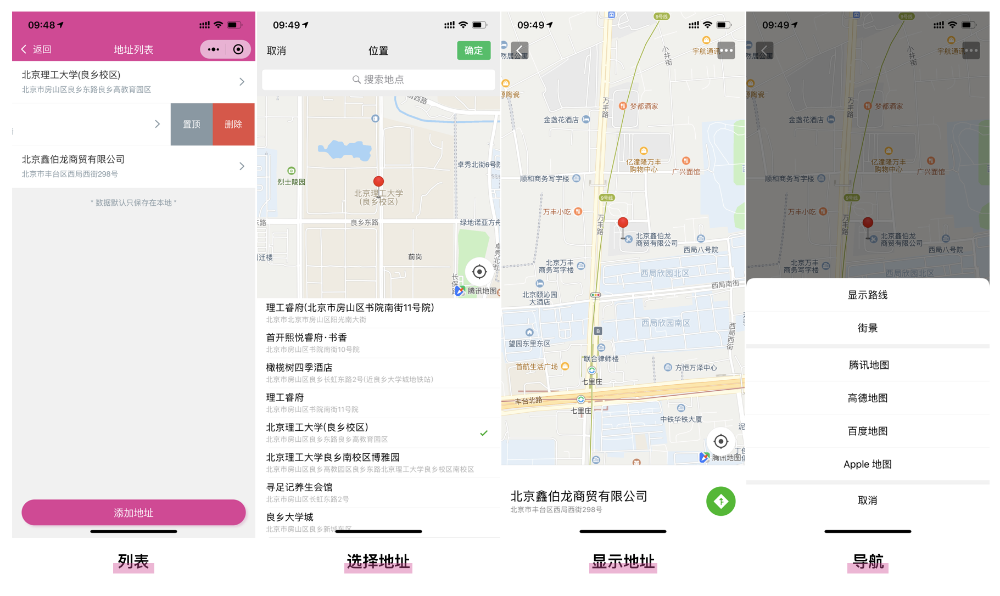

这是一个很早就有的需求，结合微信提供的地图 API，使得这个小工具的开发变得尤其简单。学习小程序的开发，将其作为第一个练手的工具，再合适不过了。

我有使用多个地图的习惯，例如：高德地图，腾讯地图以及百度地图。长途跨城开车，我通常使用高德地图，因为它的用户体验较好；短途开车或是查找商铺地址，我通常使用百度地图，因为它的商铺数据相对完整。

收藏地址的功能，应该算是刚性需求了，每一个地图软件都有这个功能。那么，做这么个小工具，想要满足什么需求呢？主要有两点：

一是，针对多地图用户，找一个统一的地方收藏地址。对我来说，这是一个痛点需求，记得第一次去处理交通违章的时候，花了一些时间，找到了处理大厅，于是，顺手就打开一个地图软件收藏了地点。然后，中间隔了好长时间，第二次去的时候，打开地图，明明记得收藏过的，可是找不到了，后来回想原来在另外一个地图软件里。

二是，提升打开效率。收藏夹的功能虽然是刚性需求，但是，对于地图软件来说，它并不是一个优先级较高的功能。往往入口藏得比较深，再加上某些地图软件的开屏广告，快速正确找到曾经收藏的那个地址，其实并不是一件轻松的事情。

这个小工具就在这样的需求背景下，诞生了。

看似有 3 个页面，其实需要开发的，只有一个列表页，「选择地址」和「显示地址」两个页面，小程序官方已经封装成了标准接口，这里只需要调用对应的 API 就可以实现了。

- 「选择地址」封装在了 `wx.chooseLocation(Object object)` 中，调用它，默认在地图中显示当前位置，同时，具备搜索地址的功能。
- 「显示地址」封装在了 `wx.openLocation(Object object)` 中，传入对应的地点参数，就可以在地图中显示地址以及周边，同时，出现导航按钮，点击弹出导航菜单，可选择任意一个导航软件，便于快速导航。

除了以上两个 API 的使用，再就是数据存储的功能了，存储数据可以直接使用数据缓存 API，这类工具产生的用户数据，最好保存在本地，放在云端，一，没有什么意义，二，还要接受官方审核，着实没有必要。

完。