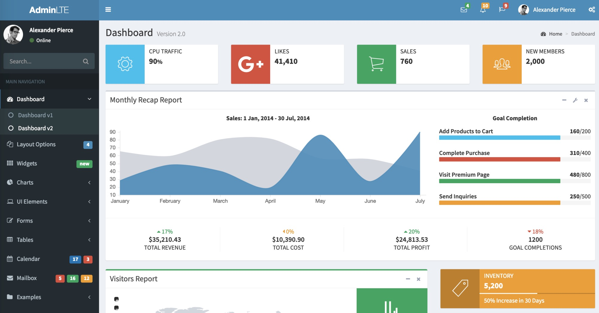
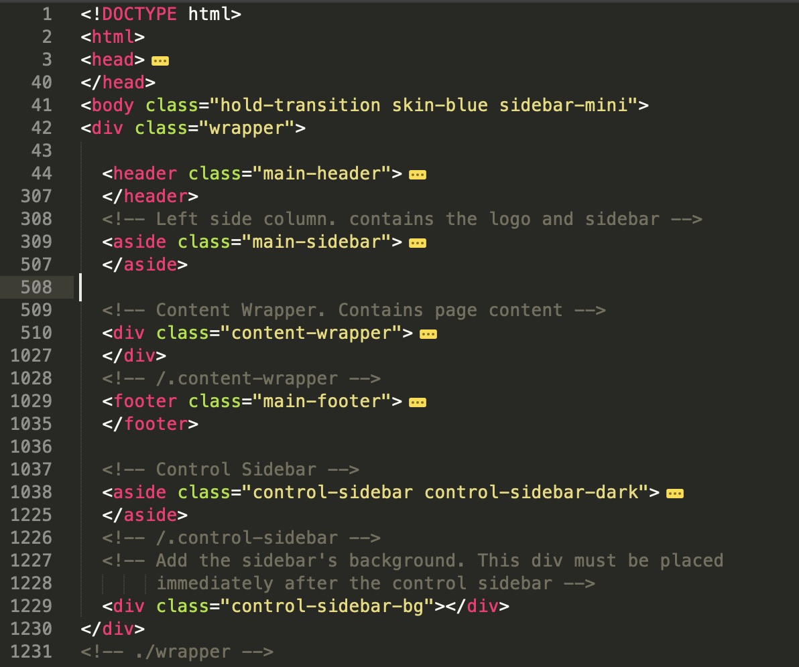
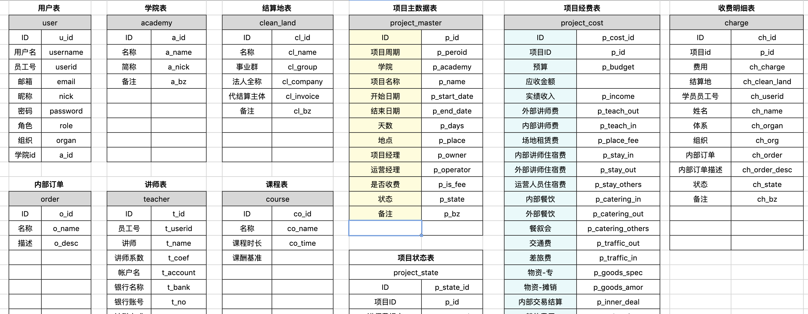

本文首发于 GitChat 平台，免费 Chat，链接：[全栈开发入门实战：后台管理系统](https://gitbook.cn/books/5cda685684e308527fba7859/index.html)

--- 

感谢你打开了这篇 Chat，在阅读之前，需要让你了解一些事情。

第一，本 Chat 虽然免费，不代表没有价值，我会将个人全栈开发的经历叙述给你，希望对你有一些帮助；
第二，文中所使用的技术栈并非最新，也并非最优。后台管理系统更多是 2B 端的产品，通常是业务优先。本 Chat 的目的是为了让你能够快速上手全栈开发。
第三，本 Chat 虽然名为全栈开发，但是不会带你做完一个完整的后台管理系统项目。一是由于篇幅有限，二是由于时间关系，个人精力也有限。

## 正文
本 Chat 的内容，正如 Chat 简介中所描述，将分为以下 5 大块：

1. 开发准备
2. 前台样式
3. 数据库连接
4. 前后台交互
5. 线上部署

你可能会发现，好像不知道要做什么，没错，后台管理系统一般都是企业内部定制开发，通常是对业务的数据管理，具体做什么功能由业务决定，但多数功能都是围绕着表格或者表单。

上面列举的仅仅是全栈开发的大致流程。首先，要做一些准备工作，例如：开发环境、编辑器环境以及依赖包配置等等工作；其次，我们要选定一个后台模版样式，快速套用，实现业务功能。（当然，你要自己开发也行，但不建议这么做，除非为了学习）；然后，根据业务做数据库的设计，编写后台数据处理逻辑，以及前后台数据交互等功能；最后，测试并部署上线。

这里的示例，将实现一个学生数据的在线管理需求，其实就是一个在线表格，包括添加，删除功能，系统层面包括登录退出功能。麻雀虽小，五脏俱全，整体架子搭好了，再在上面添加功能就简单多了。好了，现在就开始全栈之旅吧。

### 开发准备
#### 启动项目
首先要做的是，开发环境的安装，这里就不多说了，关于 Node 环境的安装，默认你已经搞定了。

既然采用 Express 作为 Web 框架，Express 也是要安装的，有了 Node 环境，安装 Express 就简单多了。我们直接上手 Express 的脚手架，全栈开发关键要速度。

```
npm install express-generator -g
```

一定记得是全局安装。安装完成之后，输入 `express -h` 可以查看帮助。这里选用 ejs 模版引擎，为什么？因为我顺手而已，这个不重要。找个合适的目录，运行下面命令：

```
express -e node-web-fullstack-demo
```

生成项目目录之后，首先要安装依赖，如下命令：

```bash
cd example-node-web-fullstack
npm install
```

等待安装完成，我们就可以启动项目了，使用命令 `npm start` ，去浏览器中，打开网址：http://localhost:3000，看到写着 Express 的首页，代表你的项目启动成功了。

#### 编辑器环境配置
一个好的编码环境，可以让你项目开发效率加倍。

首先介绍一个编辑器配置 [EditorConfig](https://editorconfig.org/)，这是一个编辑器的小工具。它有什么作用呢？简而言之，就是让你可以在不同的编辑器上，获得相同的编码风格，例如：空格缩进还是 Tab 缩进？缩进几个空格？

你可能觉得诧异，这个不是在编辑器上设置就可以了吗？没错，假设你从始至终都是在同一个电脑同一个编辑器上编码，那么可以忽略它。如果存在多电脑配合，亦或是多个编辑器配合，那么它就是神器。它几乎支持所有的主流编辑器，不用单独去编辑器中设置，配置文件就在项目中，用那个编辑器打开项目，都能获得一致的编码风格。

使用方法很简单，在根目录中新建 `.editorconfig` 文件即可。

```
# EditorConfig is awesome: https://EditorConfig.org

# top-most EditorConfig file
root = true

# Unix-style newlines with a newline ending every file
[*]
end_of_line = lf
insert_final_newline = true

# Matches multiple files with brace expansion notation
# Set default charset
[*.*]
charset = utf-8

# 4 space indentation
[*.js]
indent_style = space
indent_size = 4

# Indentation override for all JS under lib directory
[views/**.ejs]
indent_style = space
indent_size = 2
```

上面这个示例，设置了 js, ejs 的缩进，并通过 `insert_final_newline` 设置了文档末尾默认插入一个空行。还有一些有意思配置，建议你查看一下官方文档，就明白了，非常好用的一个小插件。

#### 代码检查工具
使用 js 编码，建议最好使用一款代码检查的工具，不然写到后面就会很尴尬，往往一个小的语法错误，会让你抓狂好久。代码检查工具推荐 [ESLint](http://eslint.cn/)。

使用方法也很简单，首先安装要它，`npm install eslint --save-dev`，代码检查工具通常只需要安装在开发依赖里即可。紧接着你应该设置一个配置文件：`./node_modules/.bin/eslint --init`，然后，你就可以在项目根目录下运行 ESLint：`./node_modules/.bin/eslint yourfile.js` 用来校验代码了。如果你使用的是 IDE 编码，一般都会有 ESLint 的插件来校验代码，例如在 VS Code 中安装 eslint 插件，就可以实时校验正在编辑的文件了。

配置文件里的设置参数就多了，建议自行查看官方文档。如下示例：

```json
{
    "rules": {
        "semi": ["error", "always"],
        "no-undef": "off",
        "no-unused-vars": "off",
        "no-console": "off"
    },
    "env": {
        "node": true,
        "es6": true
    },
    "extends": "eslint:recommended",
    "globals": {
        "Atomics": "readonly",
        "SharedArrayBuffer": "readonly"
    },
    "parserOptions": {
        "ecmaVersion": 2018,
        "sourceType": "module"
    }
}
```

有时候你可能会觉得很烦，默认推荐的 eslint 校验规则管得太多了，上述中我就手动关掉了「不允许使用 console」「不允许存在未定义变量」等配置。有些人可能干脆关掉了校验，但是，我还是强烈建议启用，毕竟规范的编码效率会更高。

### 前台样式
前面做了那么多工作，但似乎一点效果也看不到，别着急，这一部分的内容，就能让你直接看到效果。

前端的工作其实是非常费时的，它包括页面设计及布局等等，往往一个页面光调样式就要花费很长的时间。假如你是想快速搭建一个后台管理系统，不建议自己去写前端页面代码。很有可能，页面样式还没有出来，就已经放弃了。除非你是单纯想要学习。

建议的做法是，快速套用一个前端模版库，将大体的页面结构搭建出来，然后在上面添加业务功能。 这里采用 [AdminLTE](https://adminlte.io/themes/AdminLTE/index2.html) 这套模版库，大概效果图如下：



它是基于 bootstrap3 的后台模版，几乎不再需要做 CSS 的开发，一下子就解决了前端界面设计的大问题。下面来看看如何套用它。

#### 下载安装
推荐采用 `bower` 包管理器来安装，安装命令：`bower install adminlte` 等待下载就可以了。下载完成后，你会发现`bower_components/` 目录里多了好多目录，这些都是它的依赖包。

接下来，我们还要将整个[项目](https://adminlte.io/)下载下来，得到它的示例代码，打开其中的 `index.html` 文件，分析一下它的页面结构，好便于后面的拆解。如下图：



#### 拆解页面结构
这是后台首页的一个基本结构，分为：`main-header` 、`main-sidebar` 、`content-wrapper` 、`main-footer` 、 `control-sidebar` ，于是，我们按照这几大模块，拆分页面，分别保存为 layout 模版。在项目 `views` 下新建两个目录：`backend` 以及 `frontend` ，分别对应后台页面以及前台页面。

在 `backend` 里再新建 `layout` 目录以及 `index.ejs` 文件，`layout` 中用来保存通用的页面代码，`index.ejs` 则代表后台首页。拆解完的 `index.ejs` 代码如下：

```html
<% include ./layout/head.ejs %>
<!-- custom css files -->

<% include ./layout/header.ejs %>
<% include ./layout/main-sidebar.ejs %>

<!-- Content Wrapper. Contains page content -->
<div class="content-wrapper">
  ... 页面代码 ...
</div>

<% include ./layout/control-sidebar.ejs %>
<% include ./layout/footer.ejs %>

<!-- custom javascript files -->

<% include ./layout/foot.ejs %>
```

相信你一眼就能看出上面这段代码的意思，将一个页面拆分后，再重组，这就是最终的首页。其他的所有页面都可以通过这样的方式，进行重组，我们要写的代码，仅仅只是修改 `<div class="content-wrapper"></div>` 里的页面即可。

#### 配置静态资源目录
现在的页面，我们还不能访问，因为页面中链接的 CSS 以及 JS 文件路径都不对，模版里引用的都是相对路径，我们需要将它改为本项目里的绝对路径。打开 `layout/head.ejs` 文件，部分代码如下：

```html
<!-- Bootstrap 3.3.7 -->
<link rel="stylesheet" href="bower_components/bootstrap/dist/css/bootstrap.min.css">
<!-- Font Awesome -->
<link rel="stylesheet" href="bower_components/font-awesome/css/font-awesome.min.css">
<!-- Ionicons -->
<link rel="stylesheet" href="bower_components/Ionicons/css/ionicons.min.css">
<!-- Theme style -->
<link rel="stylesheet" href="dist/css/AdminLTE.min.css">
```

套用模块的好处就是，这些链接库的地址基本上没太大的变化，我们只需要修改一下根目录就可以了。修改之前，我们需要先配置一下项目的静态资源目录，打开项目根目录下的 `app.js` 文件，加上一行代码如下：

```javascript
...
app.use(express.static(path.join(__dirname, 'public')));
// 新添静态资源目录 bower_componennts
app.use(express.static(path.join(__dirname, 'bower_components')));
...
```

新加的这句代码意思是，将项目中 `bower_components/` 目录设置为静态资源访问的根目录，那么以上的那些静态资源，我们就知道怎么引入了，修改如下：

```html
<!-- Bootstrap 3.3.7 -->
<link rel="stylesheet" href="/bootstrap/dist/css/bootstrap.min.css">
<!-- Font Awesome -->
<link rel="stylesheet" href="/font-awesome/css/font-awesome.min.css">
<!-- Ionicons -->
<link rel="stylesheet" href="/Ionicons/css/ionicons.min.css">
<!-- Theme style -->
<link rel="stylesheet" href="/admin-lte/dist/css/AdminLTE.min.css">
```

同样的，JS 文件的引用路径也要进行修改，打开 `footer.ejs` 文件，以 `bower_components/` 为根目录，修改对应的 JS 文件路径即可。好了，该页面所有引用的静态资源路径，都已经修改正确了，接下来就是编写页面路由了。

> PS. 页面中的 JS 库并非都与自己的项目相匹配，后续要根据实际情况，进行增减。

#### 编写页面路由
页面准备好了，我们需要去编写访问路由，在这点上，Node 就与 PHP 和 Java 有所区别了，Node Web 开发不需要再搭建一个 Web 服务器，PHP 需要 Apache ，Java 需要 Tomcat，而 Node 把它交给你，让你去自定义。我们打开项目 `routes/index.js` 路由文件，编写代码如下：

```javascript
var express = require('express');
var router = express.Router();

/* GET home page. */
router.get('/', function(req, res, next) {
  res.render('index', { title: 'Express' });
});

// My backend index page
router.get('/backend', function(req, res, next){
  res.render('backend/index.ejs', {});
});

module.exports = router;
```

我们加了一个路由 `/backend` ，渲染了上面准备好的 `index.ejs` 页面，好了，我们重启一下项目，哦，对，如果已经安装了 `supervisor` ，不需要手动重启了，直接访问 `http://localhost:3000/backend` 。


细心的你可能发现，这个页面有些元素显示不正常，这是因为有些静态资源，我们没有安装而导致的加载失败，这个无需担心，因为实际页面还需要很多的时间去打磨，这个要根据实际业务来决定页面的内容，这里就不去展开了。

接下来的事情，就是改写页面代码了，整体的样式结构都有了，剩下就是对页面的删删减减了。

### 数据库连接
根据上面的内容，相信你能够添加完页面路由。当全部页面改写完毕之后，我们就相当于得到了，一个静态的后台管理系统。要达到的效果就是：点击左侧相应的导航，可以实现页面跳转，但是没有实际的数据，页面中的数据都是写「死的」，因为我们还没有连接数据库，接下来的工作就涉及到数据库的连接了。

#### 设计数据表
不管你选择哪一个数据库，首先都要做设计数据表，对于数据表的设计以及业务埋点等内容，都可以当作一本书来讲，这里不会有那么详细的内容，来教你如何设计数据表，以及业务功能埋点。但有个建议需要提一下：**不要着急去学习 SQL 语言**，你可能会说，不学习 SQL 怎么设计数据表呢？怎么操作数据库呢？

这里需要强调的是，**不是不需要学，而是开始的时候，不用着急去学**。全栈开发重要的是快，不然你全栈干啥呢？在实际的场景中，业务才是最重要的。

首先打开你的 Excel（或在线表格应用） 把表的设计做出来再说。例如下图是我当时一个项目的数据表设计：



最重要的是要去做这个事情，而不是去学数据库，别担心做得不够好，一次一次的实战会让你越来越熟练。做完这个工作，全栈开发基本算是完成了 40%，在这个过程中，一定要深入去分析业务流程，把该用到的不该用到的都要考虑进去，前期可以不做开发，但是必要的字段一定要预留。

#### 编写数据库模块
通常情况下，最好找一个趁手的数据库 GUI 工具，把数据库以及相关的表创建出来。这一步做完之后就是编写连接数据数据的代码了，建议在项目的根目录中，新建名为 `db` 的目录，用来存放所有关于数据库操作的代码。

这里我们选用 MySQL 数据库，Node 连接 MySQL 还需要安装一个数据库模块。在项目目录，执行命令 `npm install --save mysql` 即可，安装完成之后，就可以通过下面的示例，尝试连接数据库了。

```js
var mysql = require('mysql');
var connection = mysql.createConnection({
  host: 'localhost',
  user: 'me',
  password : 'secret',
  database : 'my_db'
});
connection.connect();
connection.query('SELECT 1 + 1 AS solution', function(err, rows, fields) {
  if (err) throw err;
  console.log('The solution is: ', rows[0].solution);
});
connection.end();
```

这是官方提供的一个简单例子，从上面的例子可以得出：使用`createConnection(option)`方法创建一个连接对象，然后连接对象的`connect()`方法创建连接，最后使用`query()`方法执行SQL语句，返回结果作为回调函数的参数`rows`返回，`rows`为数组类型。

通常情况下，我们会使用连接池进行连接，连接池具体实现原理就不多展开了，可以查看一下官方文档。下面直接给出使用示例。

```js
// connect.js 使用getConnection方法
var mysql = require('mysql');
var config = require('./config.json');
// 将配置写入配置文件中
var pool = mysql.createPool(config.mysql);
exports.querySQL = function(sql, callback){
    pool.getConnection(function(err,conn){
        conn.query(sql,function(err,rows,fields){
            callback(err,rows,fields); 
            conn.release();   // 不要忘了释放
        });        
    });
}
```

使用的时候，直接使用`querySQL`方法即可，如下：

```js
// db.js 查询用户信息
var connect = require('./connect.js');
exports.getUser = function(username,callback){
    var sql = 'select * from user where username = "' + username + '"';
    connect.querySQL(sql,function(err,rows,fields){
        callback(err,rows,fields);        
    });
};
```

上面示例中，直接将 sql 语句写进代码中了，通过执行 sql 语句来获得数据库数据。

这种方式优点是比较直观，但是缺点就太多了。**不安全**，**拼接字符串容易错**，**可扩展性差**等等。在实际项目中，我们往往都会选用一款 ORM 框架来连接数据库。

#### 使用 ORM 框架
关于 Node 使用 ORM 框架的介绍，我之前单独写了一篇 Chat，同样是免费的，这里我就不再赘述了。

请点击链接查看：[如何使用 Sequelize 框架快速进行 Node Web 开发](https://gitbook.cn/books/5bcc726b5464173771736c98/index.html)

### 前后台交互
通常情况下，前后台交互的开发会涉及到多个部门多个岗位协作完成，除了前后台，近几年也分离出中台的概念，专门提供接口服务。

而对于全栈开发来说，这个环节显然要简单得多了，虽然工作流程可以省，但是，必要的前中后台的框架还是要有的，分离开的好处是尽量降低功能耦合性，便于后期维护。

前台页面获取动态数据通常有的两种方式：
- 一是，被动获取，页面被渲染，后台传参给前台；
- 二是，主动获取，前台主动请求，异步获取数据。

#### 后台传参方式
关于页面展示，前面已经讲过了，根据模块改写页面，然后编写路由，就可以进行访问了。但问题是，目前页面上的一些内容都是静态的，例如：站点的名称，Logo以及标题等等。

通常情况下，这些内容不应该是写死在页面中的，而应该是动态的，从后台传来的，甚至应该是写入数据库的，将来做个修改页面，就可以随时修改网站标题以及 Logo 等信息。

这里就涉及到后台传参的相关知识点了。Express 框架给我们提供了三种传参的方式：

**（1）应用级别的传参**

使用 `app.locals` 定义参数。例如：在 app.js 文件中，`routes(app);` 语句之前加入` app.locals.hello = "Node"`，我们在任何页面中，使用 hello 这个参数都是没问题的。如何使用？建议先了解下模版引擎的用法，这里是 ejs。

**（2）路由级别的传参**

使用 `res.locals` 定义参数。例如下面例子：

```js
app.use(function (req, res, next) {
    res.locals.web = {
        title: 'STU INFO',
        name: '数据管理',
        desc: '学生数据管理',
        verifier: 0
    };
    res.locals.userInfo = {
        username: 'admin',
        title: '管理员'
    };
    res.locals.url = req.url.split('?')[0];
    next();
});
```

通过一个中间件，将站点信息写入 res.locals 对象中，于是我们在对应的页面中，就可以使用 web 以及 userInfo 等对象参数了。例如下面登陆页面部分代码（注意：这里是 ejs 模版引擎的写法）：

```html
<div class="login-logo">
    <a href="/" title="<%= web.desc %>"><b><%= web.title %> </b><%= web.name %></a>
</div>
```

**（3）页面级别的传参**

使用 `res.render()` 方法定义参数，这应该是最常用的一种方式，例如页面的 title 属性，每个页面都是不一样的，所以在渲染模版的时候，传入 title 参数，是最合适的。例如登陆页面的路由：

```js
router.get('/login', function(req, res, next) {
  res.render('login', {
      pageInfo:{
          title: '登陆页面',
      }
  });
});
```

示例中，定义了一个 pageInfo 的对象，将其当作参数传输到了前台。

#### 前台异步获取
前台主动获取数据的例子很多，通常都是通过 Ajax 异步的方式。典型的例子就是在线表格功能，因为后台管理系统几乎离不开在线表格的功能。

关于在线表格的内容，我之前写过一篇 Chat，建议阅读，同样是免费的。链接：[如何快速将线下表格数据线上化](https://gitbook.cn/books/5b91241410f55712e2fce89d/index.html)。

这里我重点介绍下，后台数据如何产出？首先要明白，数据肯定从数据库中获得，我们编写数据库 API 的时候，就应该将对应的方法封装好，前台通过访问数据路由，路由调用对应的数据库 API 即可获得数据，并返回前台。

下面看下路由的代码示例：

```js
// api
const studentHandler = require('../../db/handler/studentHandler.js');
// 当前学生列表
router.get('/list', function(req, res, next) {
    let state = 0 ; // 代表当前在校
    studentHandler.getStudentList(state, function(p){
        res.send(p);
    });
});
```

对应的数据 API 封装在了 db/handler 目录中，路由通过调用 `getStudentList` 方法，即可获得对应的学生列表，并通过 `res.send(p)` 方法返回给前台。

再来看看数据库 API 是如何编写的？代码示例如下：

```js
const { Student } = require('../relation.js');
const Sequelize = require('sequelize');
const Op = Sequelize.Op;
module.exports = {
    // 根据状态查询学生列表
    getStudentList: function(state, callback){
        Student.findAll({
            where: {
                state: state
            }
        }).then(function(data){
            callback(data);
        }).catch(function(err){
            callback(err);
        });
    },
    // 批量添加学生
    uploadStudent: function(data, callback){
        Student.bulkCreate(data).then(function(){
            callback();
        }).catch(function(err){
            callback(err);
        });
    }
};
```

重点看下 `module.exports` 对外的接口，篇幅原因，这里只提供了两个调用方法。如果这里的代码看不明白，请翻回去查看「使用 ORM 框架」这节内容中，推荐的那篇 Chat。

通常情况下，大部分功能都是通过「后台传参」以及「异步获取」这两种方式配合来实现的。

有时候甚至是取代关系，你可能会发现有些后台管理系统，进去之后，从始至终 URL 就没有变过，这一类的后台管理系统的功能实现，全部采用前台异步获取的方式。我本人不太推荐这种方式，因为想要单独展现某个页面的时候，就非常的尴尬，同时也非常不利于页面维护。

### 线上部署
当项目开发完成，本地测试完毕之后。下一步，就是部署上线了。上线部署原本是个比较繁琐的工作流程，特别针对多系统联动的情况。这里我们不考虑复杂的情况，单纯讲独立开发的后台管理系统如何快速部署到线上？

你可能会说，这有啥好讲的，把本地代码同步到服务器上，然后在服务器上启动不就得了。没错，大体是这么个意思，但是其中还是有一些点需要注意的。

#### 使用进程管理工具启动项目
这里我推荐使用 supervisor，也没其他原因，顺手而已。它是一个进程管理工具，当线上的 Web 应用崩溃的时候，它可以帮助你重新启动应用，让应用一直保持线上状态。

安装方法很简单，在命令行中，输入 `npm install -g supervisor` 即可。安装完成之后，我们需要修改一下项目的启动命令，打开 `package.json` 文件，编辑如下：

```js
...
"scripts": {
  "start": "supervisor --harmony -i views/,public/ ./bin/www",
},
...
```

`supervisor --help` 查看使用方式，以上命令，配置了 `--harmony` 模式启动 `Node` ，同时，使用 `-i` 参数忽略了 `views/` 以及 `public/` 目录。

修改完成后，我们依然使用 `npm start` 启动项目，不一样的是，当我们修改了除 `views/` 以及 `public/` 目录以外的文件后，服务将会自动重启，以确保线上一直运行的是最新版项目。

#### 使用 Git 同步代码
将代码从本地拷贝到线上，有很多种办法。这里推荐使用 Git 工具，如果没有自己的 Git 服务器，那么就使用 GitHub 类公共 Git 服务平台。大可不必担心代码泄露的问题，GitHub 不是已经提供私有仓库免费的功能了嘛，没事，放心用吧。

具体操作我就不再赘述了。

#### 使用 Nginx 反向代理服务器
为了确保性能，不建议直接在线上环境，通过 npm 或 supervisor 直接启动项目，虽然 node 本身的性能并不差，建议还是在 node 服务中间，再加一层 Web 服务器当作方向代理，与 Node 最配的当然是 Nginx 了。

安装 Nginx 不必多说，下面贴出 Nginx 对应的配置文件内容供参考。

```bash
server {
    listen       80;
    server_name xxx.com

    charset utf-8;

    #此处配置你的访问日志，请手动创建该目录：
    access_log  /var/log/nginx/js/access.log;

    location / {
        try_files /_not_exists_ @backend;
    }

    # 这里为具体的服务代理配置
    location @backend {
        proxy_set_header X-Forwarded-For $remote_addr;
        proxy_set_header Host            $http_host;
        proxy_set_header   X-Forwarded-Proto $scheme;

        #此处配置程序的地址和端口号
        proxy_pass http://127.0.0.1:8080;
    }
}
```

关键记住最后一句：proxy_pass 代理的是哪个程序地址和端口号。

最后，启动 Node 服务，启动 Nginx 服务，然后访问对应服务地址，大功告成。

### 总结
这篇 Chat 从 5 个方面讲述了全栈开发一个后台管理系统的大致流程以及部分实战内容。由于内容量远超出了预期，在写的过程中，不断的删减了很多篇幅。使得 Chat 的整体效果，没有达到我的预期。

也许这个内容，通过一篇 Chat 确实很难容下吧。所以，**我计划写完整个课程，内容包括 Node 基础、进阶应用以及Web 实战等**。从最基本的原理开始介绍，到最后全栈开发实战。

课程以**开源免费**的形式公开，GitHub 仓库地址：[Node 全栈开发入门课程](https://github.com/pengloo53/node-fullstack-course)，更新频率不定，欢迎关注。

同时，也可以关注我的微信公众号：个人学习，以便了解最新进展。

谢谢观看～
