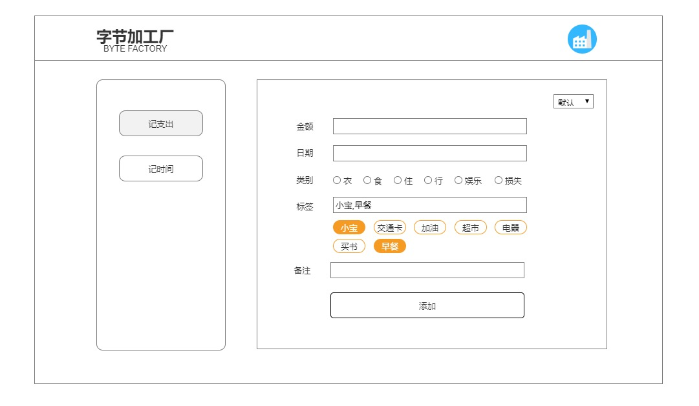
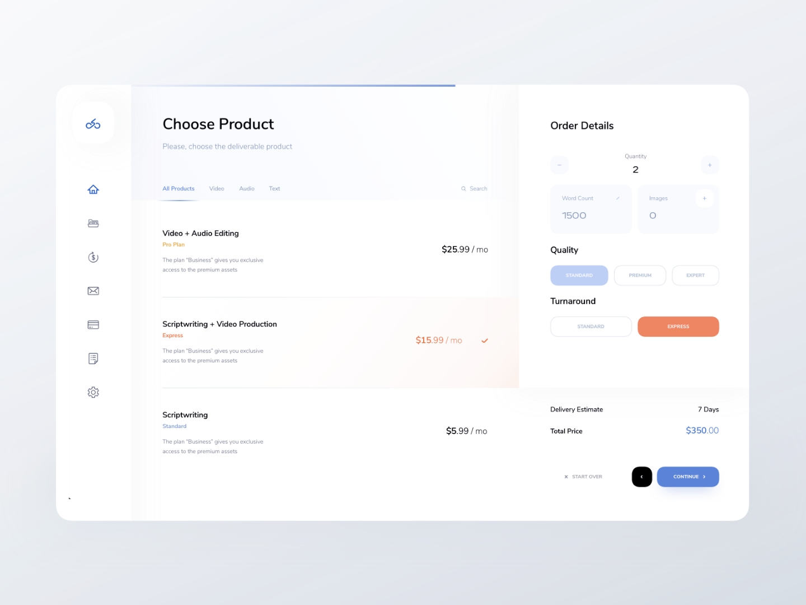
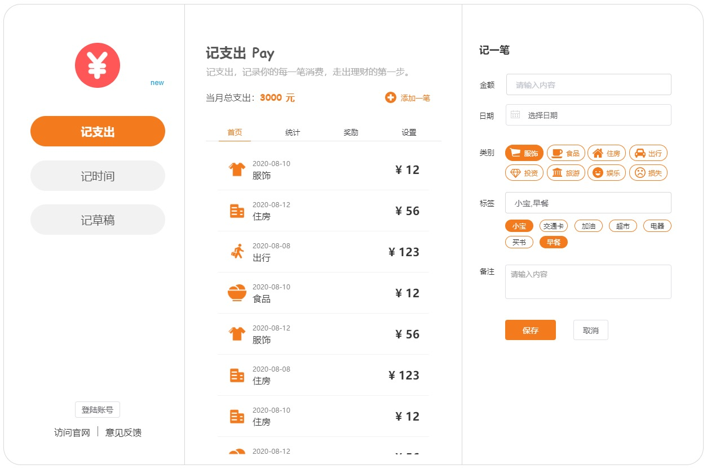

终于要开始写 Web 页面了，自从 4 月底写完「字节加工厂」的后台服务之后，一下子就放了将近 4 个月的时间，哎，只能说，人在职场，身不由己。

到了年中，公司的项目一下子多了起来，客户方也都在赶项目，为了今年的业绩，我们自然也跟着忙活起来。

再加上，最近搬家的事情，工作之余，也几乎没有时间干任何事情，终于在上周，全部搬完了，终于住进了买了将近 3 年的房子。

这个工程还是比较浩大的，从 3 月初第一次搬进东西，到 8 月初全部搞定，也持续了 5 个月的时间，实属不易。

### 技术选型

对于 Web 前端，其实我只能算作是刚入门的小白，加之前端的快速发展，早已超出了我的认知范畴，我熟悉的前端开发技术栈，感觉还停留在上个世纪，也就是传统的 HTML+CSS+JS，由于做过后台，顶多还能用个页面模板，例如 ejs 或是 pug 啥的。JS 的框架也就对 jQuery 还熟悉点，其他的，真的就无能为力了。

由于工作是产品相关，貌似知道这样也够了，再者，自己做些小项目，也远远达不到使用新框架带来的优势，反而可能会因为学习过程的痛苦而放弃，反倒不如使用旧的技术栈。

所以，很长时间都不愿意接触一些新的技术框架，比如，近几年非常火的 Vue 以及 React 等等。

而这一次要做的 side project 字节加工厂，我却偏向于选择不同于以往的技术栈，主要原因是，做它的目标就是以学习为主，学习产品设计以及技术开发，希望抛开自己以往的一些固有经验，从 0 开始，做需求，做设计，做开发，做运营。

既然是这样的思路，技术选型的标准也就是两点：

1. 自己不熟悉的
2. 当前主流的

逼着自己去接触新的技术栈，对快速推出产品来说，可能并不是一个明智的选择，但是，如果做这个产品的初衷就是为了学习，而非为了产品本身，这也是一种选择。

最终 Web 前端的技术选型是 Vue + ElementUI，替代掉自己所熟悉的 Bootstrap + jQuery，可以预想到，期间一定少不了折腾，尤其是对一个有视觉强迫症的产品经理来说，更是如此。

### 原型设计

原型对产品经理来说，应该是轻车熟路了，可是......，画原型其实并不是产品经理的关键工作内容，产品经理也并不是画原型的，就像学计算机的真的不是修电脑的一样的道理。

不过，不会画原型的产品经理，好像有点说不过去，那就画吧。「字节加工厂」中的小工具，需求都是非常普遍且大众的，不存在复杂的逻辑关系。所以，记支出的首页就是这样了。

画成这样，也是需要勇气贴出来的，看到这样的线框图，我不禁在怀疑，我一定是个假产品经理，虽说，会不会画原型对一个产品经理来说并不重要吧，但是，画成这样，也确实拿不出手。

怎么办呢？从小就没啥艺术细胞，更别谈绘画设计了。学设计也不是一天两天能有效果的，不行就模（chao）仿（xi）别人的设计吧。

模（chao）仿（xi）别人设计的网站有很多，这里我只推荐一个，那就是 [Dribbble](https://dribbble.com/)，没事多翻翻这个网站，不干别的，光看，就很赏心悦目了。

无意中，就翻到了一张图片，第一眼就感觉，就它了。「字节加工厂」的 Web 首页就是这样了。

模（chao）仿（xi）的对象有了，接下来就是真的模（chao）仿（xi）了，经过我对项目的深入了解，和潜在用户的调研分析，以及市场定位、需求分析，最终画出来，就是这样了。

其实，我知道，你根本看不出来，我这是模仿别人的设计。

